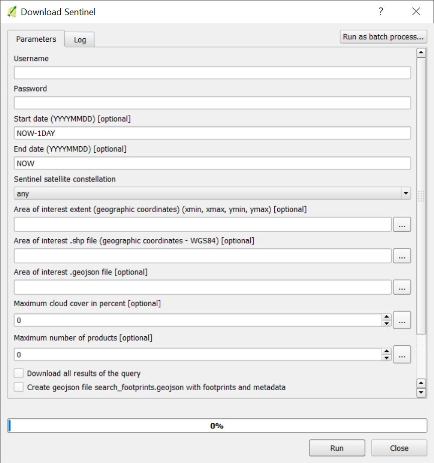

# sentinelsat_qgis_script
QGIS thin interface to sentinelsat

NB: Work in progress. Not yet fully tested.

## Installation

You need to install [`sentinelsat`](https://github.com/sentinelsat/sentinelsat) into your
QGIS Python.

### Installing `sentinelsat` on Windows

1. Start an OSGeo4W shell
1. Type `pip install sentinelsat`
1. If `pip` is not installed, enter `setup` and install the `setuptools` package

### Installing `sentinelsat` on Linux

Install ``sentinelsat`` through pip:

1. Start a bash shell
1. Type ``pip install sentinelsat``

### Installing the script

Simply place the `sentinelsat_qgis_script.py` into your `~/.qgis2/processing/scripts` 
folder or anywhere below.
